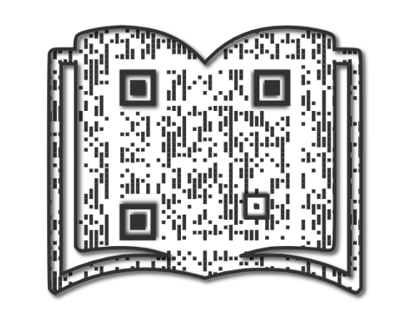

# 📚 **Proyecto Web de Biblioteca **

## **🌟 Descripción**

Bienvenido al **Proyecto Web de Biblioteca**, una plataforma interactiva que permite a los usuarios explorar listas de libros, consultar detalles y realizar filtros personalizados. El contenido se obtiene desde la **[API de libros del New York Times](https://developer.nytimes.com/docs/books-product/1/overview)**, lo que garantiza datos actualizados y reales.

---


### **¿Qué datos proporciona esta API?**
- Listas de libros organizadas por categorías.
- Información detallada de cada libro: título, autor, descripción, imagen, enlace de compra, etc.
- Fechas de publicación más antigua y más reciente en la lista.
- Número de semanas en la lista.
- Frecuencia de actualización de la lista (weekly/monthly).

### **Ejemplo de Endpoint utilizado:**

```http
GET https://api.nytimes.com/svc/books/v3/lists/current/hardcover-fiction.json?api-key=YOUR_API_KEY
=======
---

### 🔍 **Vista Detallada de Libros**

Al hacer clic en una lista, el usuario podrá:

- 🪄 Cambiar la vista del DOM para mostrar los libros de esa lista.
- 📚 Ver los libros **ordenados según la posición oficial** (del NYTimes).
- ✨ Consultar para cada libro:
  - 📖 **Carátula del libro**
  - 🧾 **Descripción**
  - 🏷️ **Título** y **autor**
  - 📊 **Número de semanas** en la lista
  - 📈 **Posición** oficial (#1, #2, #3…)
  - 🔗 **Enlace de compra en Amazon** (se abre en una nueva pestaña)

- 🔙 Volver a la vista de todas las listas con un **botón de "Volver atrás"**.

---

### ⚙️ **Filtros y Organización**

- 🔄 Filtro por **frecuencia**: semanal / mensual
- 🗂️ Filtro por **categoría** con buscador de texto con sugerencias
- 📆 Ordenar por **fecha más antigua / más reciente**
- 🔤 Ordenar categorías **A-Z / Z-A**
- 👤 Búsqueda por **autor**
- 📖 Búsqueda por **título**
- ↕️ Ordenación de libros por **autor o título** (A-Z / Z-A)

---

## 📱 **Escanea el Código QR para Acceder a la Web**

¡Accede fácilmente a la aplicación web escaneando el siguiente código QR! Donde podrás explorar todas las listas de libros más vendidos por categoría, ver detalles de cada libro y realizar búsquedas.

### ¿Cómo usarlo?

1. Abre la cámara de tu teléfono móvil.
2. Escanea el código QR que aparece a continuación.
3. ¡Serás redirigido a la web donde podrás empezar a explorar!



**¡No olvides visitar mi web y explorar las categorías de libros más vendidos!**
### 👀 [Ver proyecto](https://midifi26.github.io/mi_biblioteca_dashboard/)

